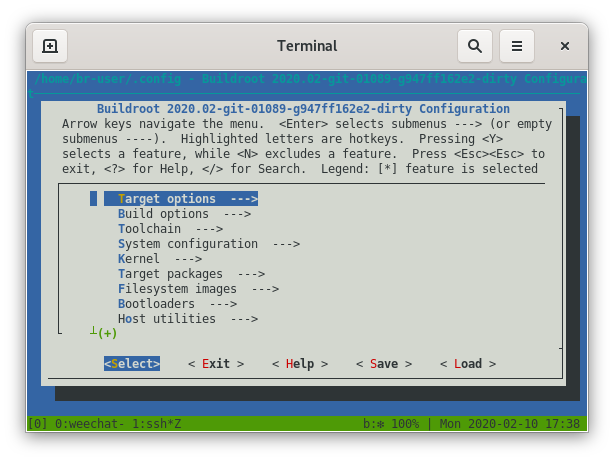

## Overview
- Tesla use Buildroot to construct rootfs
- WebKit vunerabilities
- Chromium Embedded Framework (CEF)
  - http://opensource.spotify.com/cefbuilds/index.html
- CEF is not in Buildroot
- Rushed Ubuntu container

```{dot,fig.width=4,fig.align="center",echo=F}
digraph {
	rankdir="LR"
	webkit [image="images/webkit_520x520.png", label="", shape=none]
	cef [image="images/chromium_520x520.png", label="", shape=none]
	webkit -> cef [minlen=5, penwidth=10]
}
```

<div class="notes">
- Buildroot
  - Different configs for different devices: cars, EV chargers
  - Little bit more complicated, Tesla have a wrapper
- pwn2own
- CEF
  - Framework, embedding Chromium w.browser in another application
  - Release cadence every 6 weeks
  - Some other applcaitons: Amazon Music, Steam, Spotify
  - Spotify maintains dev + stable releases
- Tesla slapped together an Ubuntu container which builds CEF
  - Uses a different toolchain, built against different libs
  - Problem: doesn't scale for different target architectures
</div>

## Tooling
TODO Image of htop
TODO maybe this slide should move
<div class="notes">
- Insane build machine
- 128 Cores, 128GB ram, 1TB NVMe
</div>

## Tooling
- Tools repo TODO move me?
- Container

## Buildroot: High level
Buildroot is a tool that **simplifies** and automates the process of building a complete Linux system for an embedded system, using **cross-compilation**.

- It does 💪
  - Basic dependency graphing
  - Bootstrap a cross-toolchain + host environment
  - Create a rootfs image (BusyBox, kernel, u-boot)
- It does not 😒
  - Cache package builds (can use pre-built toolchain)
  - Verify dependencies
  - Build remotely

<div class="notes">
- Bootstrap a cross-toolchain (glibc, uClibc-ng, musl)
- Bootstrap from minimal
</div>

## Buildroot: menuconfig
<center>

</center>

## Buildroot: packages
```{bash,eval=F}
$ tail -12 package/bc/bc.mk
BC_VERSION = 1.07.1
BC_SITE = http://ftp.gnu.org/gnu/bc
BC_DEPENDENCIES = host-flex
BC_LICENSE = GPL-2.0+, LGPL-2.1+
BC_LICENSE_FILES = COPYING COPYING.LIB
BC_CONF_ENV = MAKEINFO=true
BC_AUTORECONF = YES

$(eval $(autotools-package))
```
```{bash,eval=F}
$ make bc
```
```{bash,eval=F}
$ output/target/usr/bin/bc --version
bc 1.07.1
```

## Buildroot: packages
```{bash,eval=F}
$ ls -1 package/bc
0001-bc-use-MAKEINFO-variable-for-docs.patch
0002-notice-read-and-write-errors-on-input-and-output.patch
0003-dc-fix-exit-code-of-q-command.patch
0004-no-gen-libmath.patch
bc.hash
bc.mk
Config.in

$ head -5 package/bc/Config.in
config BR2_PACKAGE_BC
        bool "bc"
        help
          'bc' is an arbitrary precision numeric processing language
          Its syntax is similar to C, but differs in many substantial
```

## Buildroot: packages (host)
```{bash,eval=F}
$ tail -9 package/libyaml/libyaml.mk
LIBYAML_VERSION = 0.2.2
LIBYAML_SOURCE = yaml-$(LIBYAML_VERSION).tar.gz
LIBYAML_SITE = http://pyyaml.org/download/libyaml
LIBYAML_INSTALL_STAGING = YES
LIBYAML_LICENSE = MIT
LIBYAML_LICENSE_FILES = LICENSE

$(eval $(autotools-package))
$(eval $(host-autotools-package))
```
```{bash,eval=F}
$ make host-libyaml
```
```{bash,eval=F}
$ find output/host/ -name libyaml.so
output/host/lib/libyaml.so
```


## Buildroot: 
- Layout
	- Makefiles
	- Kconfig
	- packages
		- host
		- target
- GCC toolchain
- pkg-config
- LLVM support

<div class="notes">
- 
</div>

## Chromium Embedded Framework
- Project layout
- Ninja
- CEF Python
- V8 Snapshot

## Integration
- pkg-config changes

## Upstream first
